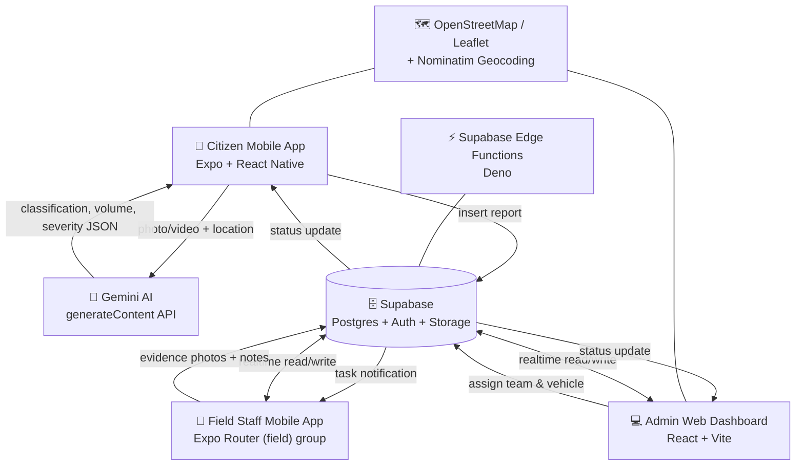

# SwachhLens

### AI-Powered Mobile App for Waste Detection, Reporting, Classification, Prioritization, and Smarter Cleanup Management.

## 🔐 Demo Credentials

| Role           | Email                      | Password   |
| -------------- | --------------------------- | ---------- |
| 👤 Citizen     | `sandeepbusy54@gmail.com`  | `12345678` |
| 👷 Field Staff | `swainsandeep67@gmail.com` | `12345678` |
| 🏛️ Admin      | `sandeepbusy54@gmail.com`  | `12345678` |

---

## 1. 🎯 About SwachhLens

Garbage dumps and overflowing bins usually stay unreported until they turn into a health hazard — citizens don't know who to call, and municipal staff have no reliable way to know where the worst spots are or which one to clean first.

**SwachhLens** turns any citizen's phone into a waste-reporting sensor. A citizen simply photographs a waste issue; **Google Gemini** analyzes the image in real time to identify the waste type, estimate its volume, and score its severity — instantly turning a photo into a prioritized, geo-tagged complaint. Admins verify and assign the complaint to a field cleanup team through a live web dashboard, and the team updates its progress from a dedicated field app, with photographic proof closing the loop back to the citizen.

---

## 2. ✨ Key Features

**👤 Citizen**
- Report waste by photo or video, with AI auto-fill of category, severity, and urgency
- Live location tagging with a drag-to-pin map and reverse geocoding
- Automatic **duplicate-report detection** for nearby, recent complaints of the same type
- Real-time report status tracking (Submitted → Team Assigned → In Progress → Resolved)
- "My Reports" history, saved locations, personal impact stats, and in-app notifications
- Community waste-hotspot map and post-resolution feedback

**👷 Field Staff**
- Live task list assigned by the admin team, with severity and location details
- Step-by-step task flow: *On the Way → Reached (live map) → In Progress → Submit for Review*
- Upload after-cleanup evidence photos and notes for admin approval
- Personal task history, stats, and profile management

**🏛️ Admin / Municipal Authority**
- Central dashboard with live stats, trend charts, and a heatmap of complaints
- Complaint management with AI analysis, severity gauge, timeline, and history per report
- Team & vehicle management with assignment, live location mini-maps, and workload charts
- AI Analytics: confidence trends, waste-volume charts, duplicate clusters, and an AI-generated narrative report
- Waste Hotspots page with insights and exportable data
- User management (citizens & field teams), blocking, and email-based team onboarding
- Real-time notifications and a Reports & Insights AI assistant chat

---

## 3. 👥 User Roles

**Citizen**
Captures and submits waste reports, reviews AI-generated severity/category before submitting, tracks the live status of their complaints, and gives feedback once a report is resolved.

**Field Staff**
Receives complaints assigned by the admin, travels to the site (tracked live), performs the cleanup, and submits after-photos + notes as proof of work for admin review.

**Admin / Municipal Authority**
Verifies and prioritizes incoming reports, assigns the right team and vehicle, reviews field-team evidence before marking a complaint resolved, and monitors city-wide waste trends, hotspots, and team performance from the dashboard.

---

## 4. 🔄 Complete Software Flow

```text
Citizen
   ↓
Capture Waste Image/Video (camera or gallery)
   ↓
AI Detection & Classification (Gemini: waste type + volume)
   ↓
Priority Assessment (Gemini: severity score, risk factors, urgency)
   ↓
Duplicate Check (nearby/recent reports in the same category)
   ↓
Waste Report Submitted (status: Submitted)
   ↓
Admin Verification (Complaints dashboard, AI Analysis tab)
   ↓
Team & Vehicle Assignment (status: Team Assigned)
   ↓
Field Staff Action — On the Way → In Progress
   ↓
Cleanup & Evidence Upload (photos + notes, status: Pending Review)
   ↓
Admin Review & Approval (status: Resolved / Completed)
   ↓
Citizen + Admin Tracking (live status, notifications, feedback)
```

---

## 5. 🏗️ System Architecture



**Notes on the actual stack:**
- The **Citizen App** and **Field Staff App** are the *same* Expo Router project — the field experience lives under the `app/(field)/` route group, and both share `lib/supabase.ts`.
- **Supabase** is the single backend: Postgres database, Auth, Storage (`report-media` bucket, evidence photos), Realtime (`postgres_changes` subscriptions), and Edge Functions (for admin-only user management).
- **Gemini** is called directly from the client with a strict JSON response schema — there is no separate AI microservice.
- Maps use **Leaflet + OpenStreetMap** tiles (via `react-leaflet` on the web admin, and an injected Leaflet HTML page inside a `WebView` on mobile), with **Nominatim** for reverse geocoding.

---

## 6. 🧠 AI/ML Workflow

```text
Photo/Video → Gemini 3.6 Flash (generateContent) → Structured JSON (schema-enforced)
     → Waste Type Detection → Volume Estimation → Severity & Risk Scoring → Report
```

| Aspect | Details |
| --- | --- |
| **Model** | Google **Gemini 3.6 Flash** (`gemini-3.6-flash`) |
| **API** | Gemini `generateContent` REST endpoint (`generativelanguage.googleapis.com`), called directly from the mobile client — [lib/gemini.ts](lib/gemini.ts) |
| **Input** | Base64-encoded photo/video frame + optional reverse-geocoded address as location context |
| **Output** | A strict, schema-validated JSON object (`responseSchema` forces structured output — no free-text parsing) |
| **Waste Type Detection** | `primaryType` / `secondaryType` from 8 fixed categories (Overflowing Bin, Garbage Dump, Plastic Waste, Construction Debris, Organic Waste, E-Waste, Hazardous Waste, Drain Blockage), plus confidence %, detected objects, and a type-mix breakdown |
| **Volume Estimation** | Size tier (Small/Medium/Large/Very Large), approximate liter range, frame-coverage %, and a visible scale reference |
| **Severity / Prioritization** | 0–100 severity score, Low/Medium/High/Critical level, and Normal/High/Urgent priority — derived from 5 risk factors: waste volume, location, drainage risk, hazard, and spread/road-blocking |
| **Duplicate Detection** | Computed independently in-app (not by the AI) — [lib/duplicate-check.ts](lib/duplicate-check.ts) uses a Haversine-distance search over the same category within 300 m / 72 h of existing reports |
| **AI in the Admin Panel** | The Gemini API is also called from the web admin ([admin_panel/src/lib/ai-report.ts](admin_panel/src/lib/ai-report.ts)) to generate the narrative sections of the AI Analytics report, and to power the Reports & Insights assistant chat ([admin_panel/src/lib/assistant.ts](admin_panel/src/lib/assistant.ts)) |
| **How it connects** | The AI result is attached directly to the `reports` row (`analysis` JSON column) at submission time, so every downstream screen (citizen tracking, admin complaint detail, AI Analytics) reads from one source of truth |

---

## 7. 🛠️ Technology Stack

| Layer | Technology |
| --- | --- |
| Mobile App (Citizen + Field Staff) | **Expo SDK 57** / React Native 0.86, Expo Router (file-based routing), TypeScript |
| Web / Admin Panel | **React 19 + Vite + TypeScript**, Tailwind CSS, React Router |
| Backend | **Supabase** (Postgres, Auth, Storage, Realtime, Edge Functions) |
| Database | **Supabase Postgres** (SQL migrations in [admin_panel/supabase/](admin_panel/supabase/)) |
| AI/ML | **Google Gemini 3.6 Flash** (`generateContent` API, schema-constrained JSON output) |
| Authentication | **Supabase Auth** (email/password, session-based, role separation via app route/UI) |
| Maps & Geolocation | **Leaflet** + **OpenStreetMap** tiles, **Nominatim** reverse geocoding, `expo-location` |
| Charts | **Recharts** (admin dashboard & AI analytics) |
| Notifications / Email | Supabase Realtime (in-app), **EmailJS** (team-onboarding emails from the admin panel) |
| Serverless Functions | **Supabase Edge Functions** (Deno) — user creation, auth-metadata listing, block/unblock |
| Hosting / Deployment | **EAS** (Expo Application Services) for the mobile app build/APK; Vite static build for the admin panel |

---

## 8. 📂 Project Structure

```text
swachhlens/
├── app/                        # Expo Router screens (Citizen + shared flows)
│   ├── (tabs)/                 #   Citizen bottom-tab screens: Home, Report, My Reports, Profile
│   ├── (field)/                #   Field Staff bottom-tab screens: Home, Tasks, Map, Reports, Profile
│   ├── login.tsx, signup.tsx   #   Auth screens (shared by citizen & field staff)
│   ├── report-scan.tsx …       #   Report creation flow (capture → AI analysis → confirm → submit)
│   └── field-task-*.tsx        #   Field task detail / on-the-way / progress / submitted screens
├── components/                 # Shared/reusable UI components (themed views, tabs, pickers)
├── contexts/                   # React context (report-flow-context: multi-step report state)
├── hooks/                      # Custom hooks (color scheme, cooldown, theme color)
├── lib/                        # Core business logic & Supabase/AI clients
│   ├── supabase.ts             #   Supabase client init
│   ├── gemini.ts                #   AI waste detection/classification/severity engine
│   ├── reports.ts               #   Citizen report CRUD, status, realtime subscriptions
│   ├── field-tasks.ts, field-team.ts, field-media.ts, field-notifications.ts, field-ui.ts, field-report-stats.ts
│   ├── duplicate-check.ts       #   Nearby/recent duplicate-report detection
│   ├── geocoding.ts, geo.ts, map-html.ts  # Location & map utilities
│   ├── citizen-notifications.ts, feedback.ts, profile.ts
├── admin_panel/                # Standalone web admin dashboard (Vite + React)
│   ├── src/pages/               #   Dashboard, Complaints, Teams, Vehicles, Users, AI Analytics, Waste Hotspots, Feedback, Notifications
│   ├── src/components/          #   Feature-grouped UI (complaints, teams, vehicles, ai-analytics, hotspots, dashboard, layout…)
│   ├── src/contexts/            #   Auth, Reports, Teams, Vehicles, Profiles, Feedback, Notifications, Theme
│   ├── src/lib/                 #   Supabase queries, stats, AI report generation, EmailJS
│   └── supabase/                #   SQL migrations (001–009) + Edge Functions (create-team-member, list-users-auth-meta, set-user-blocked)
├── APK/                        # Static "download the app" landing page + APK preview image
├── assets/                     # App icons, images, fonts
└── app.json, eas.json          # Expo app config & EAS build profiles
```

---

## 9. 🚀 How to Run the Project

### 💻 Web / Admin Panel

```bash
cd admin_panel
npm install
```

Create a `.env` file in `admin_panel/` (see `admin_panel/.env.example`) with:

```env
VITE_SUPABASE_URL=your-supabase-project-url
VITE_SUPABASE_ANON_KEY=your-supabase-anon-key
VITE_EMAILJS_SERVICE_ID=your-emailjs-service-id
VITE_EMAILJS_TEMPLATE_ID=your-emailjs-template-id
VITE_EMAILJS_PUBLIC_KEY=your-emailjs-public-key
VITE_PUBLIC_GEMINI_API_KEY=your-gemini-api-key
```

```bash
npm run dev
```

Open the printed local URL (Vite default: **http://localhost:5173**) and log in with the Admin demo credentials above.

### 📱 Mobile App (Citizen + Field Staff)

```bash
# from the project root
npm install
```

Create a `.env` file in the project root with:

```env
EXPO_PUBLIC_SUPABASE_URL=your-supabase-project-url
EXPO_PUBLIC_SUPABASE_ANON_KEY=your-supabase-anon-key
EXPO_PUBLIC_GEMINI_API_KEY=your-gemini-api-key
```

```bash
npx expo start
```

Then:
- Press **`a`** to run on a connected Android device/emulator, or **`i`** for iOS
- Or scan the QR code with **Expo Go** on your physical device
- Log in as **Citizen** (`accountType: user`) or **Field Staff** (`accountType: fieldTeam`) using the demo credentials above — the same app serves both roles based on the login screen's account-type toggle

To build a native Android app instead of using Expo Go:

```bash
npx expo run:android
```

**Installing the pre-built APK:** open [APK/index.html](APK/index.html) (the app's download landing page) or grab the APK from your EAS build output, then install it directly on an Android device (enable "install from unknown sources" if prompted).

### 🤖 AI/ML

No separate AI service to run — Gemini is called directly over HTTPS from both the mobile app ([lib/gemini.ts](lib/gemini.ts)) and the admin panel ([admin_panel/src/lib/ai-report.ts](admin_panel/src/lib/ai-report.ts)). Just ensure `EXPO_PUBLIC_GEMINI_API_KEY` (mobile) and `VITE_PUBLIC_GEMINI_API_KEY` (admin) are set to a valid [Google AI Studio](https://aistudio.google.com/) API key.

---

## 10. 📱 Application Screens

**Citizen Mobile App**
> _Add screenshots: Home, Report Capture, AI Analysis Result, My Reports, Report Status Tracking, Waste Hotspots Map._

**Field Staff Mobile App**
> _Add screenshots: Task List, On-the-Way Live Map, Task Progress, Evidence Submission._

**Admin Dashboard**
> _Add screenshots: Dashboard Overview, Complaints Table & AI Analysis Tab, Teams & Assignments, Waste Hotspots, AI Analytics._

---

## 11. 📊 Complaint Lifecycle

**Citizen Report Status** — shown to the citizen and driven by admin/field actions:

```text
Submitted → Team Assigned → In Progress → Resolved
```

**Field Team Assignment Status** — the detailed backend flow behind the citizen-facing status above:

```text
Pending (New) → On the Way → In Progress → Pending Review → Completed
```

The field team drives the assignment from `Pending` through `Pending Review` (submitting evidence photos + notes); an admin then reviews and approves it, which flips it to `Completed` and mirrors the parent report's status to `Resolved` — closing the loop back to the citizen in real time via Supabase Realtime.

---

## 12. 🌍 Impact

- **Faster, richer reporting** — a photo is enough; AI fills in category, volume, and severity automatically instead of relying on manual, inconsistent descriptions.
- **Smarter prioritization** — a 0–100 severity score and Normal/High/Urgent priority let admins act on the worst dumps first, not just the earliest-reported ones.
- **Fewer redundant complaints** — automatic duplicate detection stops the same dump site from generating a flood of separate tickets.
- **Coordinated field response** — teams and vehicles are assigned and tracked from one dashboard, with a live "on the way" map instead of phone-call coordination.
- **Verified cleanups** — nothing is marked resolved until an admin reviews photographic evidence from the field team, closing the loop with proof, not just a status flag.
- **City-wide transparency** — citizens track their own report in real time, while admins see hotspot maps, trends, and team workload at a glance.

---

## 13. 🔮 Future Scope

- On-device / offline AI inference for areas with poor connectivity
- Push notifications (native) instead of in-app-only alerts
- Route optimization for field teams across multiple assigned tasks
- Public open-data API for municipal transparency dashboards
- Multi-language support for citizen-facing screens
- Gamification (leaderboards, civic points) to encourage more citizen reporting
- Integration with municipal vehicle telematics for real-time fleet tracking
